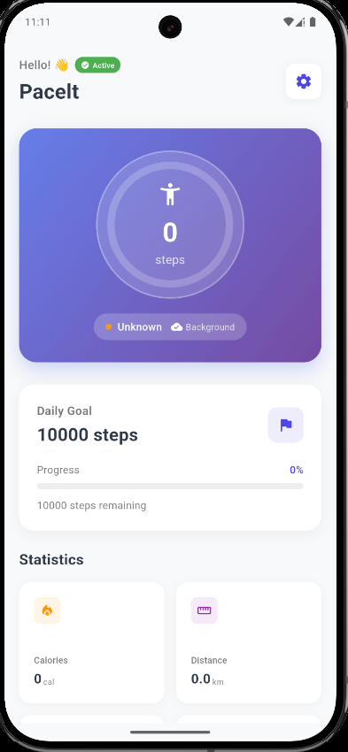

# Pacelt - Step Counter App

A beautiful and elegant step counter application built with Flutter that tracks your daily steps with a modern design.

## ✨ Recent Updates & Improvements

### 🌍 Enhanced Multi-Language Support
- **NEW**: German language support added (🇩🇪 Deutsch)
- Complete translation for all UI elements
- Instant language switching between English, Turkish, and German

### 🎨 Theme System Improvements
- **Fixed**: Daily goal card now properly adapts to light/dark themes
- **Enhanced**: Better color consistency across all UI components
- **Updated**: Modern Material Design 3 compliance
- **Improved**: Better contrast and readability in both themes

### 🚀 Advanced Step Tracking System
- **Intelligent Error Detection**: Automatically handles device restarts and sensor errors
- **Smart Step Validation**: Filters out unrealistic step increases (>1000 steps at once)
- **Sensor Recovery**: Auto-reinitializes sensors on errors
- **Improved Accuracy**: Better step count filtering and validation

### 📊 Enhanced Calculations
- **Realistic Calorie Calculation**: 0.045 calories per step (more accurate)
- **Precise Distance Measurement**: 0.000762 km per step (average step length)
- **Better Statistics**: More accurate duration and pace calculations

### 🔄 Robust Background Service
- **Reliable Sync**: Enhanced 15-minute interval synchronization
- **Error Tracking**: Background error monitoring and logging
- **Data Safety**: Prevents data loss during app lifecycle changes
- **Smart Reset**: Improved daily reset with previous day data preservation

### 🛠️ Code Quality Improvements
- **Flutter Analyze**: All linting issues resolved (0 warnings/errors)
- **Deprecated APIs**: Updated to latest Flutter standards
- **Performance**: Optimized memory usage and battery consumption

## Features

- 📱 **Real-time Step Tracking**: Monitor your steps throughout the day with intelligent validation
- 🎯 **Daily Goals**: Set and track your daily step goals with progress visualization
- 📊 **Progress Tracking**: View your walking progress with beautiful animated charts
- 🔔 **Background Monitoring**: Robust background tracking that continues even when app is closed
- 💾 **Data Persistence**: Your step data is safely saved with backup mechanisms
- 🎨 **Modern UI**: Clean, theme-aware interface with Material Design 3
- 🌍 **Multi-Language Support**: Full localization with English, Turkish, and German
- 🔄 **Smart Language Switcher**: Instant language switching with flag indicators
- 🧠 **Intelligent Error Handling**: Auto-recovery from sensor errors and system issues
- ⚡ **Optimized Performance**: Battery-efficient with smart sync intervals

## Screenshots



## Installation

### Prerequisites

Before you begin, ensure you have the following installed:

- [Flutter](https://flutter.dev/docs/get-started/install) (version 3.8.1 or higher)
- [Dart](https://dart.dev/get-dart) (comes with Flutter)
- [Android Studio](https://developer.android.com/studio) or [Xcode](https://developer.apple.com/xcode/) for device testing

### Getting Started

1. **Clone the repository**
   ```bash
   git clone https://github.com/sw3do/pacelt-app.git
   cd pacelt-app
   ```

2. **Install dependencies**
   ```bash
   flutter pub get
   ```

3. **Run the application**
   ```bash
   flutter run
   ```

### Platform-specific Setup

#### Android Setup
- Minimum SDK version: 21
- Target SDK version: 34
- Permissions required: Activity Recognition, Boot Completed

#### iOS Setup
- Minimum iOS version: 12.0
- Permissions required: Motion & Fitness access

## Dependencies

This project uses the following key packages:

- **pedometer** (^4.0.2): For step counting functionality
- **permission_handler** (^12.0.0+1): Managing device permissions
- **shared_preferences** (^2.2.2): Local data storage
- **workmanager** (^0.6.0): Background task management
- **easy_localization** (^3.0.7): Multi-language support
- **provider** (^6.1.2): State management for theme system
- **cupertino_icons** (^1.0.8): iOS-style icons

## Building for Production

### Android APK
```bash
flutter build apk --release
```

### Android App Bundle
```bash
flutter build appbundle --release
```

### iOS
```bash
flutter build ios --release
```

## Permissions

The app requires the following permissions:

### Android
- `android.permission.ACTIVITY_RECOGNITION`
- `android.permission.RECEIVE_BOOT_COMPLETED`
- `android.permission.WAKE_LOCK`

### iOS
- Motion & Fitness access

## Language Support

The app supports multiple languages with complete localization:

### Supported Languages
- **English (US)** 🇺🇸 - Default language with full feature support
- **Turkish (TR)** 🇹🇷 - Complete localization including all UI elements
- **German (DE)** 🇩🇪 - **NEW**: Complete German translation

### Language Features
- **Instant Language Switching**: Change language on-the-fly through the language button in header
- **Automatic Detection**: System language detection on first app launch
- **Persistent Settings**: Language preference saved across app sessions
- **Complete Translation**: All UI elements, messages, and dialogs are fully localized
- **Dynamic UI Updates**: Interface updates immediately without app restart

### How to Change Language
1. Tap the 🌍 language button in the top-right corner
2. Select your preferred language:
   - 🇺🇸 **English**
   - 🇹🇷 **Türkçe** 
   - 🇩🇪 **Deutsch** *(NEW)*
3. The app interface will immediately update to the selected language

## Theme System

### Dynamic Theme Support
- **Light Theme**: Clean, modern design with optimal readability
- **Dark Theme**: Eye-friendly dark mode for low-light usage
- **System Theme**: Automatically follows your device's theme preference
- **Instant Switching**: Theme changes apply immediately across all screens

### Theme Features
- **Material Design 3**: Latest design standards
- **Consistent Colors**: Unified color scheme across all components
- **Accessibility**: High contrast ratios for better readability
- **Battery Optimized**: Dark theme reduces battery usage on OLED displays

## Advanced Features

### Intelligent Step Tracking
- **Error Detection**: Automatically identifies and corrects sensor errors
- **Data Validation**: Filters out unrealistic step increases
- **Auto-Recovery**: Reinitializes sensors when errors occur
- **Background Sync**: Reliable 15-minute interval synchronization

### Smart Calculations
- **Accurate Calories**: 0.045 cal/step based on scientific research
- **Precise Distance**: 0.000762 km/step using average stride length
- **Real-time Stats**: Live updates for pace, duration, and progress

### Data Management
- **Auto-Save**: Steps saved every 50 counts to prevent data loss
- **Daily Reset**: Smart daily reset with previous day data preservation
- **Background Persistence**: Data continues tracking even when app is closed
- **Error Logging**: Comprehensive error tracking for troubleshooting

## Project Structure

```
lib/
├── main.dart                 # App entry point with enhanced initialization
├── screens/                  # UI screens with theme support
├── models/                   # Data models with validation
├── services/                 # Enhanced business logic and APIs
└── widgets/                  # Reusable theme-aware UI components

assets/
└── translations/
    ├── en.json               # English language translations
    ├── tr.json               # Turkish language translations
    └── de.json               # German language translations (NEW)

images/
└── app.png                   # App screenshot for documentation

android/
├── app/
│   ├── build.gradle.kts      # Android build configuration
│   └── src/main/
│       └── AndroidManifest.xml  # Android permissions and services

ios/
└── Runner/
    ├── Info.plist            # iOS app configuration
    └── ...                   # iOS specific files
```

## Development Notes

### Code Quality
- ✅ **Flutter Analyze**: All linting issues resolved
- ✅ **No Deprecated APIs**: Updated to latest Flutter standards
- ✅ **Memory Optimized**: Efficient resource management
- ✅ **Battery Friendly**: Optimized background operations

### Performance Optimizations
- Smart sync intervals to reduce battery usage
- Efficient state management with Provider pattern
- Optimized background task scheduling
- Memory leak prevention in stream subscriptions

## Troubleshooting

### Common Issues

1. **Steps not tracking**: 
   - Ensure Activity Recognition permission is granted
   - Restart the app if sensors fail to initialize

2. **Background tracking stopped**:
   - Check device battery optimization settings
   - Ensure app is not killed by system battery management

3. **Language not changing**:
   - Close and reopen language dialog
   - App will update immediately upon selection

## Contributing

1. Fork the repository
2. Create your feature branch (`git checkout -b feature/amazing-feature`)
3. Commit your changes (`git commit -m 'Add some amazing feature'`)
4. Push to the branch (`git push origin feature/amazing-feature`)
5. Open a Pull Request

## License

This project is licensed under the MIT License - see the [LICENSE](LICENSE) file for details.

## Support

If you have any questions or need help, please:

- Open an issue on GitHub
- Contact us at sw3doo@gmail.com

## Acknowledgments

- Flutter team for the amazing framework
- Contributors to the open-source packages used in this project
- Community feedback for continuous improvements

---

Made with ❤️ using Flutter | **Version 2.0** - Enhanced with intelligent tracking, multi-language support, and robust theme system
